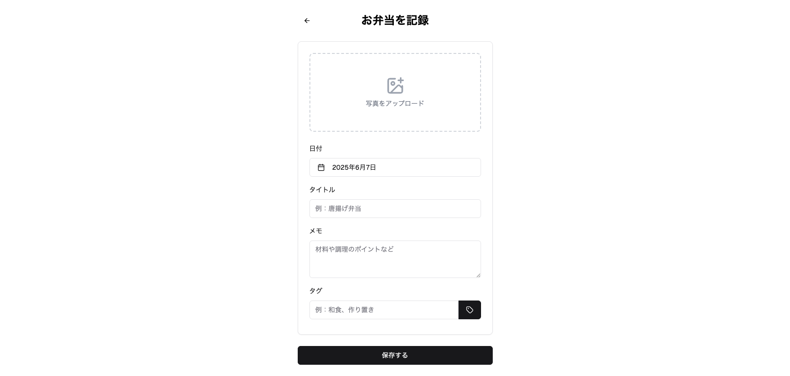
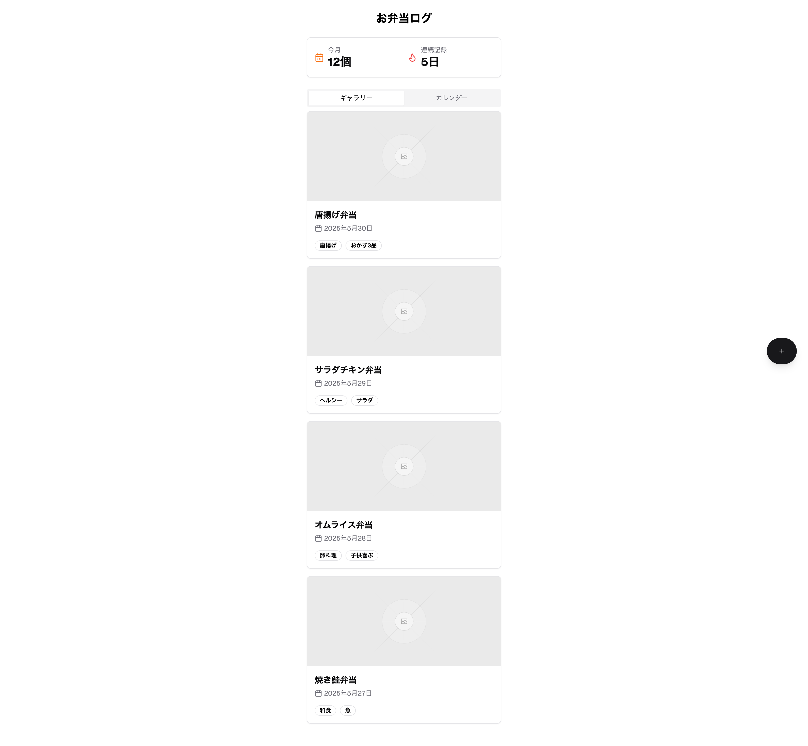
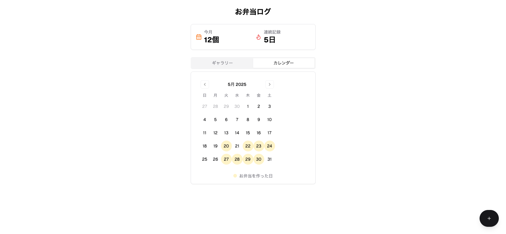

# LunchPix仕様書

## 🎯 目的（MVP時点）
毎日のお弁当を写真＋メモで記録して、
自分だけの「お弁当ギャラリー」を作る

## 🛠 MVPに含める機能

### 1. 📷 弁当写真の記録（コア機能）
スマホから写真をアップロード

日付自動入力（手動修正も可）

タイトル／メモ欄（自由入力）

### 2. 🗓 一覧・カレンダー表示
写真一覧（時系列）

カレンダービュー（弁当作った日は印付き）

### 3. 🔍 タグ登録・検索（シンプル版）
自由にタグ付け（例：和風／冷凍なし／作り置き）

タグでフィルター表示

### 4. 🧮 弁当回数カウント
今月の弁当作成数表示

連続記録日数（習慣化の励み）

## 🧪 MVPでやらないこと
SNS投稿／他人の弁当閲覧（後回し）

栄養バランス解析（まずは記録だけ）

食材・費用管理（将来拡張可）

## 🖼 モック画面イメージ（ざっくり）

### 📱 ホーム
上部：今月の弁当数・連続記録

中央：カレンダー or 写真一覧タブ

下部：「＋弁当を記録」ボタン

### 📱 記録画面
写真アップ

タイトル（例：からあげ＆ひじき）

メモ欄

タグ（自由入力）

## 💡 技術スタック（想定）
要素	技術例
フロントエンド	React / Next.js + Tailwind CSS
バックエンド	Supabase（画像＆DB管理が楽）
認証	Next Auth
画像保存	Supabase Storage
デプロイ	Vercel

## DB設計
